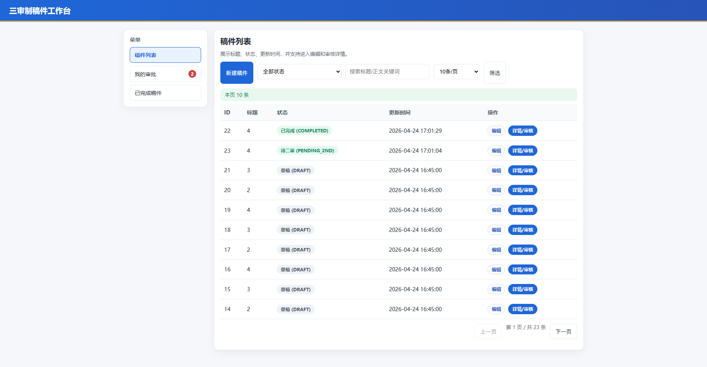
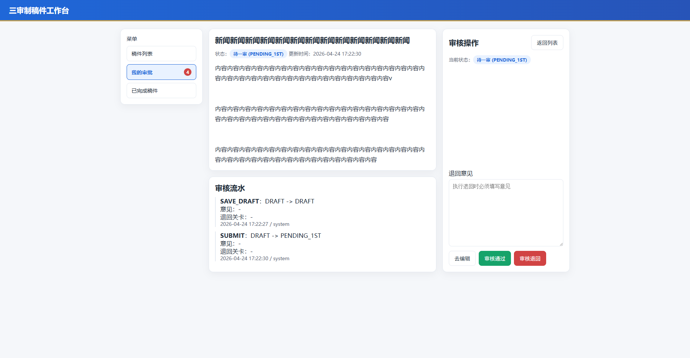
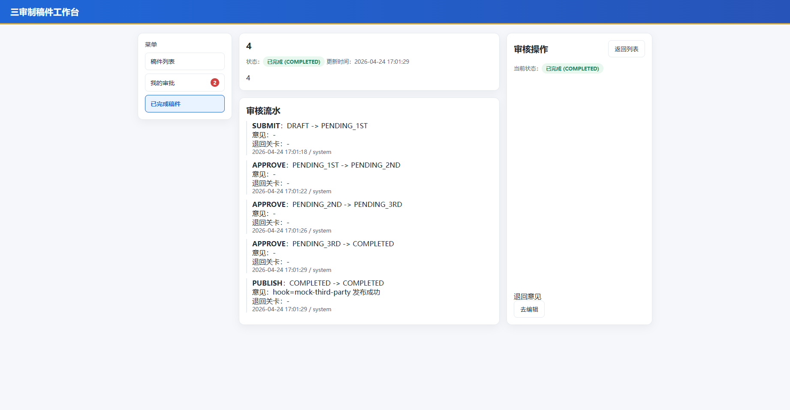
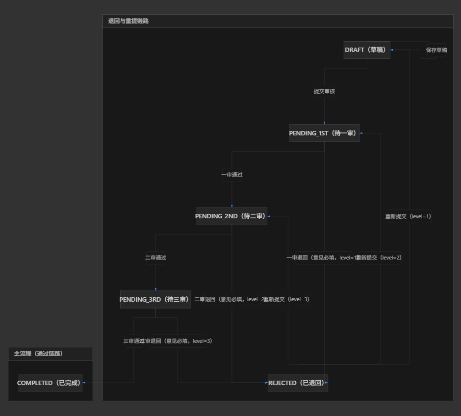

# 三审制稿件工作台（MVP）

一个最小可用的稿件审批系统，覆盖“创建稿件 -> 三审流转 -> 退回重提 -> 完成归档”的完整流程。









## 项目特点

- 三审流程闭环：支持一审、二审、三审与退回重提
- 状态可追踪：每次操作都有审核流水记录
- 轻量实现：Spring Boot + MySQL + 原生 HTML/JS
- 列表检索与分页：`keyword` / `status` / `statuses` 筛选，`pageNo` / `pageSize` 分页；`GET /api/v1/manuscripts/count` 返回 `total` 便于「第 X 页 / 共 Y 条」
- 发布解耦：三审完成后通过 `ThirdPartyPublishHook` 扩展（默认模拟实现），流水含 `PUBLISH` 动作便于验收

## 技术栈

- Java 17
- Spring Boot 3.2.4
- MyBatis
- MySQL 8.x
- 前端：原生 HTML + JavaScript（Fetch API） ，后续版本可以拆分React。

## 快速启动

1. 准备环境：JDK 17+、Maven、MySQL
2. 创建数据库并执行脚本：`sql/schema-sfc-flow-test.sql`
3. 配置开发库连接：`src/main/resources/application-dev.yml`
4. 启动项目：

```powershell
mvn spring-boot:run
```

启动后访问：

- `http://localhost:8080/`

## 文档

- `doc/01-需求详细设计.md`
- `doc/02-技术架构选型设计.md`
- `doc/03-数据库表与字段模型设计.md`
- `doc/04-代码模块与接口设计.md`
- `doc/05-测试计划.md`
- `doc/06-页面风格设计.md`
- `doc/07-交付标准.md`

