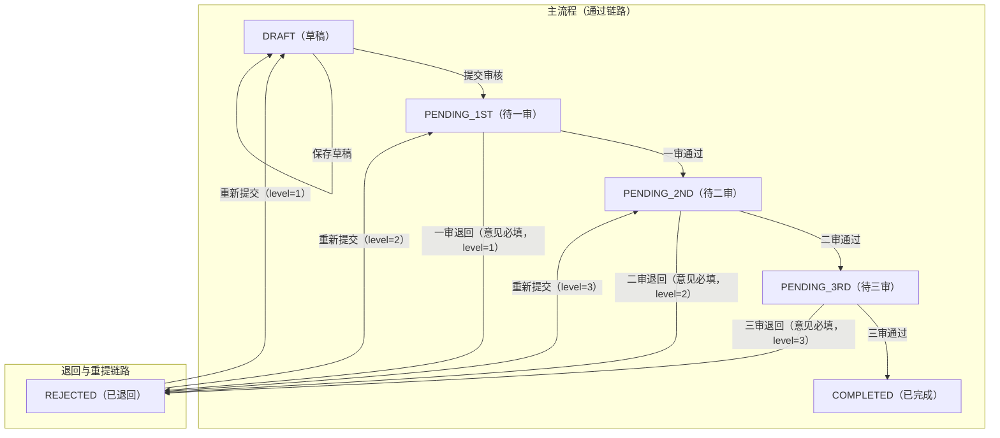

# 三审制稿件工作台 - 需求详细设计（MVP）

本文根据《最小可用“三审制”稿件工作台》PDF整理，目标是让需求、系统设计与审批流规则更直观，便于研发和验收统一口径。

---

## 1. 建设目标与范围

### 1.1 MVP目标
- 完成稿件从创建到三审结束的最小业务闭环。
- 明确状态机规则，保证每次状态变更可追溯。
- 提供可运行的前后端功能：列表、编辑、详情/审核。

### 1.2 MVP范围
- 稿件创建与编辑（标题、正文）
- 草稿保存与提交审核
- 一审/二审/三审的通过与退回（退回意见必填）
- 退回后重新提交并按规则回到指定节点
- 审核流水查询（时间、动作、意见、状态变化）

### 1.3 非MVP范围（加分项）
- 账号与RBAC权限
- 富文本与素材管理
- 搜索、分页、全文检索
- 外部发布Hook、消息通知、AI辅助

---

## 2. 系统设计模块

## 2.1 业务模块视图

| 模块 | 子模块 | 核心职责 |
|------|--------|----------|
| 稿件管理模块 | 稿件编辑、稿件查询 | 维护标题/正文；支持草稿保存、稿件详情展示 |
| 审批流模块 | 状态机引擎、审批动作处理 | 执行提交/通过/退回/重提，校验状态合法性 |
| 审核记录模块 | 流水记录、轨迹展示 | 记录每次操作与状态变更，供详情页追踪 |
| 前端页面模块 | 列表页、编辑页、详情/审核页 | 按状态展示可执行动作，驱动用户操作 |
| 接口服务模块 | 稿件接口、审核接口、流水接口 | 对前端提供统一API并做参数/状态校验 |
| 数据存储模块 | 稿件表、审核流水表 | 持久化稿件状态与审核历史，保证一致性 |

## 2.2 前后端职责划分

- 前端：负责页面交互、按钮展示、表单校验（如退回意见必填的前置提示）。
- 后端：负责最终业务校验与状态变更控制，拒绝非法流转。
- 数据层：状态更新和流水写入建议在同一事务中完成，避免“状态变了但无流水”。

## 2.3 页面与模块映射

| 页面 | 对应模块 | 主要能力 |
|------|----------|----------|
| 稿件列表页 | 稿件管理模块 | 展示标题、状态、更新时间，进入详情/编辑 |
| 稿件编辑页 | 稿件管理模块 | 编辑内容、保存草稿、提交审核 |
| 详情/审核页 | 审批流模块 + 审核记录模块 | 查看全文与当前状态，执行通过/退回/重提，查看流水 |

---

## 3. 审批流状态机设计

## 3.1 状态定义

| 中文语义 | 状态码 |
|----------|--------|
| 草稿 | `DRAFT` |
| 待一审 | `PENDING_1ST` |
| 待二审 | `PENDING_2ND` |
| 待三审 | `PENDING_3RD` |
| 已退回 | `REJECTED` |
| 已完成 | `COMPLETED` |

## 3.2 状态机流转图（Mermaid，单图可读版）

以下合并为一张图：主流程在上，退回/重提在下，规则不变。

### 3.2.1 level映射表（便于快速理解）

| 退回时所在审核关 `level` | 重新提交后目标状态 | 业务含义 |
|--------------------------|--------------------|----------|
| `1` | `DRAFT` | 一审退回后，回到草稿 |
| `2` | `PENDING_1ST` | 二审退回后，回到待一审 |
| `3` | `PENDING_2ND` | 三审退回后，回到待二审 |

## 3.3 流转规则说明

- 正向流程：`DRAFT -> PENDING_1ST -> PENDING_2ND -> PENDING_3RD -> COMPLETED`。
- 退回规则：仅待审状态可退回，且退回意见必填，状态统一进入`REJECTED`。
- 重提规则：`REJECTED`根据退回时审核关`level`返回上一关：
  - level=1 -> `DRAFT`
  - level=2 -> `PENDING_1ST`
  - level=3 -> `PENDING_2ND`
- 完成规则：`COMPLETED`为终态，只允许查看，不允许编辑和审核动作。

---

## 4. 操作权限矩阵（按状态）

| 状态 | 允许操作 | 禁止操作 |
|------|----------|----------|
| `DRAFT` | 编辑、保存草稿、提交审核 | 审核通过、审核退回、重新提交 |
| `PENDING_1ST` | 审核通过、审核退回 | 编辑、保存草稿、重新提交 |
| `PENDING_2ND` | 审核通过、审核退回 | 编辑、保存草稿、重新提交 |
| `PENDING_3RD` | 审核通过、审核退回 | 编辑、保存草稿、重新提交 |
| `REJECTED` | 编辑、重新提交 | 审核通过、审核退回 |
| `COMPLETED` | 查看详情 | 编辑、提交、通过、退回、重提 |

---

## 5. 数据与接口设计要点

## 5.1 数据模型要点

- 稿件实体至少包含：标题、正文、当前状态、更新时间。
- 当状态为`REJECTED`时，需保存最近一次退回关卡`reject_level`用于重提计算。
- 审核流水需记录：稿件ID、操作类型、操作前状态、操作后状态、意见、操作时间。

## 5.2 接口设计要点

- 查询类接口：稿件列表、稿件详情、审核流水。
- 写操作接口：保存草稿、提交审核、审核通过、审核退回、重新提交。
- 后端必须做状态合法性校验；前端展示限制仅作为体验增强，不作为最终约束。

---

## 6. 验收标准（MVP）

- [ ] 草稿提交后可依次通过一审、二审、三审并进入`COMPLETED`。
- [ ] 任一待审节点可退回且意见必填，退回后状态为`REJECTED`并记录`level`。
- [ ] `REJECTED`重提后按`level`返回正确节点（1/2/3均验证）。
- [ ] 列表、编辑、详情/审核页面可完整跑通，详情可查看完整审核流水。
- [ ] 非法状态流转被后端拒绝（例如在`COMPLETED`执行退回）。
