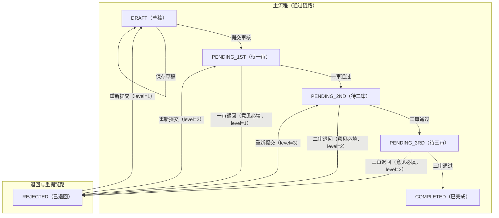

# 系统设计说明

---

## 1. 简述前后端交互的 API 接口设计

完整接口文档见：[04-代码模块与接口设计.md](doc/04-%E4%BB%A3%E7%A0%81%E6%A8%A1%E5%9D%97%E4%B8%8E%E6%8E%A5%E5%8F%A3%E8%AE%BE%E8%AE%A1.md)

接口文档示例： 

### 创建稿件
- 方法：`POST`
- 路径：`/api/v1/manuscripts`

请求体：
```json
{
  "title": "标题示例",
  "body": "正文示例"
}
```

处理规则：
- 新建稿件默认状态为`DRAFT`。
- 同步写入一条`SAVE_DRAFT`流水（可选但建议，便于全链路审计）。


---

## 2. 简述数据模型设计方案

完整表结构设计见：[03-数据库表与字段模型设计.md](doc/03-%E6%95%B0%E6%8D%AE%E5%BA%93%E8%A1%A8%E4%B8%8E%E5%AD%97%E6%AE%B5%E6%A8%A1%E5%9E%8B%E8%AE%BE%E8%AE%A1.md)

###  稿件主表 `ms_manuscript`

####  建表目的
存储稿件正文与当前状态，是审批流状态机的“当前快照”。

####  字段定义

| 字段名 | 类型 | 非空 | 默认值 | 说明 |
|--------|------|------|--------|------|
| `id` | `BIGINT UNSIGNED` | 是 | 自增 | 主键 |
| `title` | `VARCHAR(500)` | 是 | - | 稿件标题 |
| `body` | `MEDIUMTEXT` | 是 | - | 稿件正文 |
| `status` | `VARCHAR(32)` | 是 | - | 当前状态码（见状态枚举） |
| `reject_review_level` | `TINYINT UNSIGNED` | 否 | `NULL` | 退回时审核关卡（1/2/3），仅`REJECTED`时有意义 |
| `created_at` | `DATETIME(3)` | 是 | `CURRENT_TIMESTAMP(3)` | 创建时间 |
| `updated_at` | `DATETIME(3)` | 是 | `CURRENT_TIMESTAMP(3)` + ON UPDATE | 更新时间 |

---

###  审核记录表 `ms_review_record`

####  建表目的
记录提交、通过、退回、重提、保存草稿等动作，作为审计与问题排查依据。

####  字段定义

| 字段名 | 类型 | 非空 | 默认值 | 说明 |
|--------|------|------|--------|------|
| `id` | `BIGINT UNSIGNED` | 是 | 自增 | 主键 |
| `manuscript_id` | `BIGINT UNSIGNED` | 是 | - | 关联稿件ID |
| `action` | `VARCHAR(32)` | 是 | - | 动作码（见动作枚举） |
| `from_status` | `VARCHAR(32)` | 否 | `NULL` | 变更前状态 |
| `to_status` | `VARCHAR(32)` | 否 | `NULL` | 变更后状态 |
| `opinion` | `VARCHAR(2000)` | 否 | `NULL` | 审核意见，`REJECT`时必填 |
| `reject_level` | `TINYINT UNSIGNED` | 否 | `NULL` | 本次退回关卡（1/2/3） |
| `operator_id` | `BIGINT UNSIGNED` | 否 | `NULL` | 操作人ID（MVP可固定） |
| `operator_name` | `VARCHAR(64)` | 否 | `NULL` | 操作人展示名 |
| `created_at` | `DATETIME(3)` | 是 | `CURRENT_TIMESTAMP(3)` | 操作时间 |

---

## 3. 说明你的状态流转设计思路

完整需求设计见：[01-需求详细设计说明.md](doc/01-%E9%9C%80%E6%B1%82%E8%AF%A6%E7%BB%86%E8%AE%BE%E8%AE%A1.md)




## 4. 加分项完成情况

- 3. 检索与性能：⽀持稿件列表的搜索、分⻚，或简单全⽂检索。 
        ✅ 页面已实现
- 4. 发布解耦：预留第三⽅发布接⼝ Hook，⽀持审核结束后模拟对接外部平台。
        ✅ 设计了 `ThirdPartyPublishHook` 接口，三审通过后触发 `ManuscriptCompletedEvent`，模拟调用 Hook。
- 其他项目因时间关系未完成，后续有需要可提供思路。


